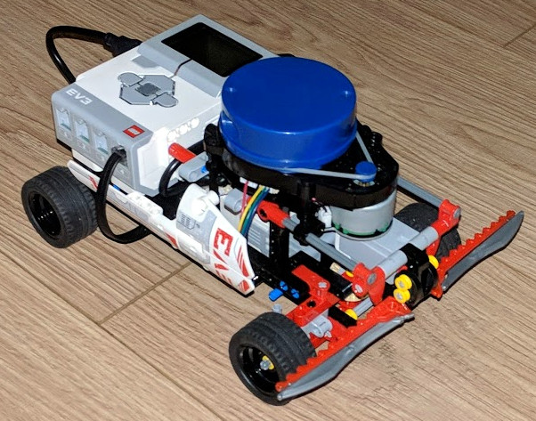

# YDLidarCar
This project provides the software for the YDLidarCar project. 
This software requires ev3dev OS on the Lego Mindstorms EV3.
The project contains a modified version of the [YDLidar SDK](https://github.com/yangfuyuan/sdk).

## Modified version the YDLidar SDK / ydlidar_driver light
The original SDK uses a thread to poll and buffer incoming data from the YDLidar's virtual serial port.
This is unnecessary (at least under Linux) as the OS buffers more than enough data for us. 
Therefor, this thread was removed to improve performance.
Unfortunately, the EV3 brick is too slow to process all incoming data from the Lidar (at least without further optimization). 
To avoid increasingly delayed data processing, the driver was modified discard old buffer content before fresh data is collected.

These modifications enable the use of an YDLidar X4 with ev3dev, even without the use of a [BrickPi](https://www.dexterindustries.com/BrickPi/ "BrickPi").

## Installation
The application was cross compiled using the [ev3dev cross-compiler Docker image](https://www.ev3dev.org/docs/tutorials/using-docker-to-cross-compile/).

If ev3dev-lang-cpp is not installed within the docker image, it must be checked out and compiled within the cross compiler environment as follows:

```
    $ cd YDLidarCar/crossbuild-docker
    $ git clone https://github.com/ddemidov/ev3dev-lang-cpp.git
    Enter cross compiler environment
    $ sudo docker run --rm -it -v <ABSOLUTE PATH TO ../..>:/ev3dev -w /ev3dev ev3cc
    $ cd YDLidarCar/crossbuild-docker/ev3dev-lang-cpp
    $ mkdir build
    $ cmake -D CMAKE_CXX_COMPILER=/usr/bin/arm-linux-gnueabi-g++-4.9 -D CMAKE_C_COMPILER=/usr/bin/arm-linux-gnueabi-gcc ../
    $ make
    $ cd ../..
```

Now, we can compile YDLidarCar simply by calling make within YDLidarCar/crossbuild-docker:

```
    $ make
```

As result, the executable *YDLidarCar* will be in the make folder.

## Structure

### Class Lidar
Simple API to use the Lidar.
Note that the method *std::vector<std::tuple<float, float>> Lidar::scan()* replaces the SDK method *CYdLidar::doProcessSimple(outscan, hardwareError)*.

The code contains settings specific for the YDLidar X4. 
Baud rate and/or the conversion of *distance_q2* can be modified to make the code work with other models.

### Class CarControl
Initializes and controls the steering, motor and reads the bumper of the [car](LDD-CAD/LidarCar.lxf) designed for this project.



The [car](LDD-CAD/LidarCar.lxf) is designed using the Lego Digital Designer and the model is included in this project.
It requires the Lego Mindstorms EV3 set 31313 and a gear differential part 6573.

### Class CruiseControl
A demonstration how to use the classes mentioned above.

[](https://www.youtube.com/watch?v=NyMrNpszMj8)
